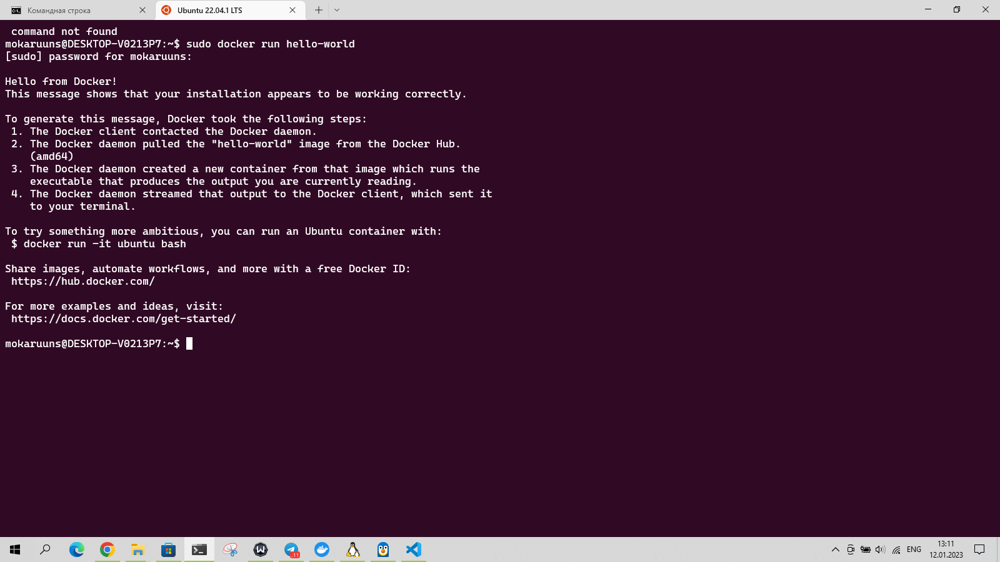
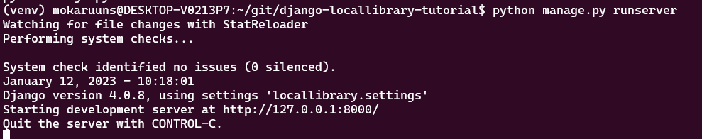
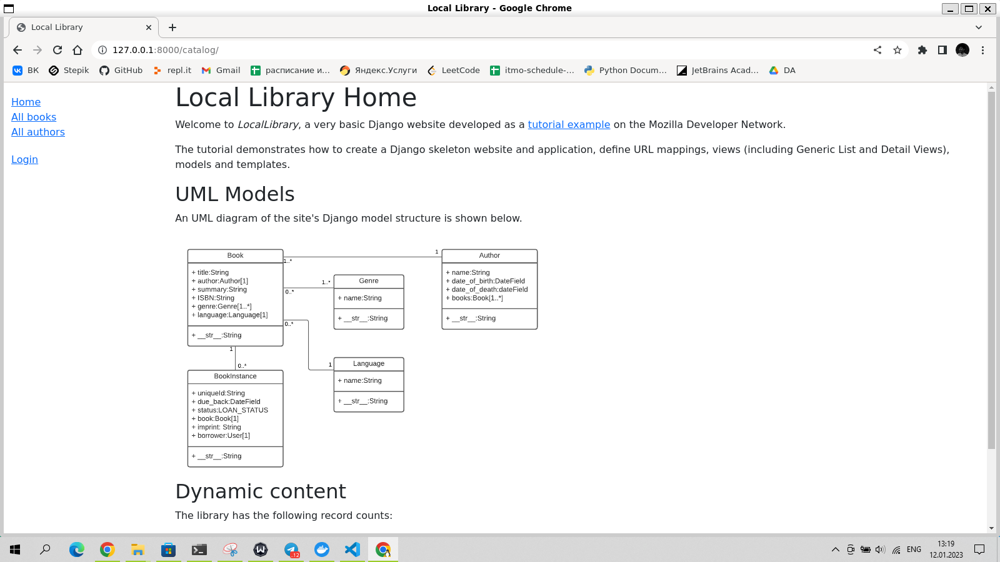

# Docker & Docker-compose

## Полезные команды docker

- docker ps -a - список всех контейнеров
- docker stop <name> - остановить контейнер
- docker build -t <name> . - собрать образ из Dockerfile
- docker run -d -p 8000:8000 <name> - запустить контейнер на порту 8000 в фоне
- docker rm $(docker ps -a -q -f status=exited) - удалить все остановленные контейнеры

## sudo docker run hello-world


## .env
```
SECRET_KEY="dk8H2njsS28S"
DEBUG=True
```

## запущенный сайт 
  
  

## создадим Dockerfile, docker-compose.yml и nginx.conf
```
touch Dockerfile docker-compose.yml nginx.conf
```

## Dockerfile
```
FROM python:3

RUN mkdir -p /urs/src/app

WORKDIR /usr/src/app

COPY . /usr/src/app

RUN pip install -r requirements.txt
RUN python3 manage.py makemigrations
RUN python3 manage.py migrate
RUN python3 manage.py collectstatic
RUN echo $(python3 manage.py test)
CMD gunicorn locallibrary.wsgi:application --bind 0.0.0.0:8000
```

